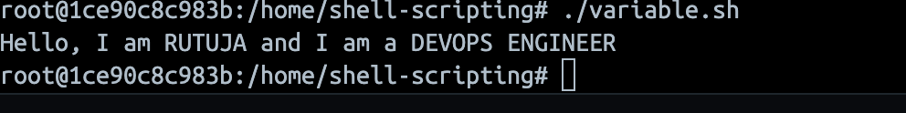
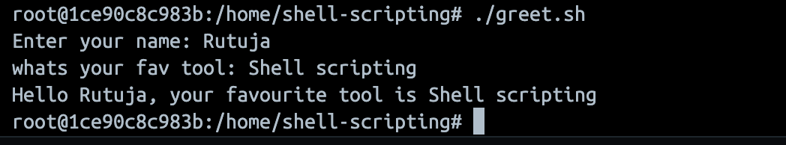
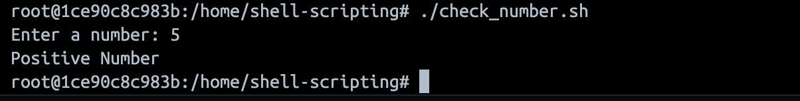
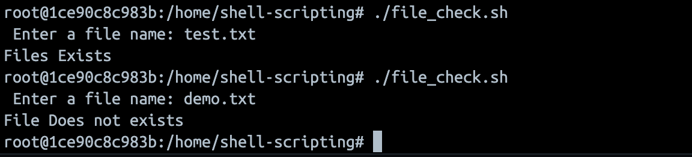

## Task 1: Your First Script

```bash
#!/bin/bash
echo "Hello, DevOps!"
```
output


## Task 2: Variables

```bash
#!/bin/bash

NAME="RUTUJA"
ROLE="DEVOPS ENGINEER"
echo "Hello, I am $NAME and I am a $ROLE"
```
output


## Task 3: User Input with read
```bash
#!/bin/bash

read -p "Enter your name: " name
read -p "whats your fav tool: " tool
echo "Hello $name, your favourite tool is $tool"
``` 
output


## Task 4: If-Else Conditions

```bash
#!/bin/bash

read -p "Enter a number: " Num

if [ "$Num" -gt 0 ]; then
    echo "Positive Number"
elif [ "$Num" -lt 0 ]; then
    echo "Negative Number"
else
    echo "Zero"
fi
```
output



```bash
#!/bin/bash

read -p "Enter filename: " file

if [ -f "$file" ]; then
    echo "File exists"
else
    echo "File does not exist"
fi
```
output


## Task 5: Combine It All

```bash
#!/bin/bash

service_name="nginx"

read -p "Do you want to check the status? (y/n): " choice

if [ "$choice" = "y" ]; then
    if systemctl status "$service_name" | grep -q "Active: active (running)"; then
        echo "$service_name is active"
    else
        echo "$service_name is not active"
    fi
else
    echo "Skipped"
fi

```

output
