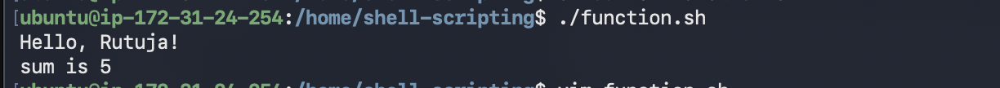
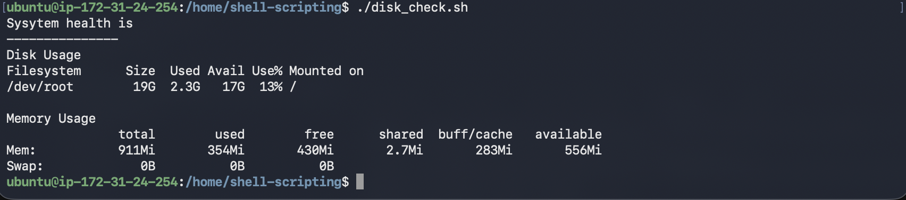
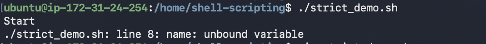
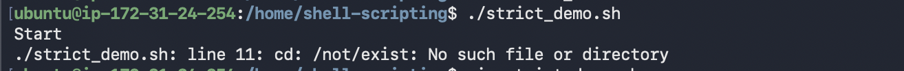
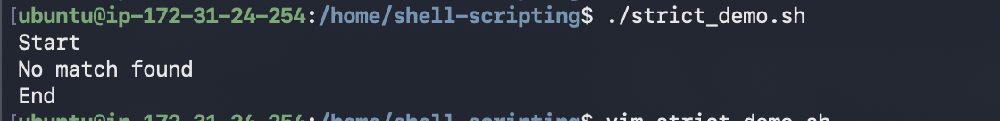
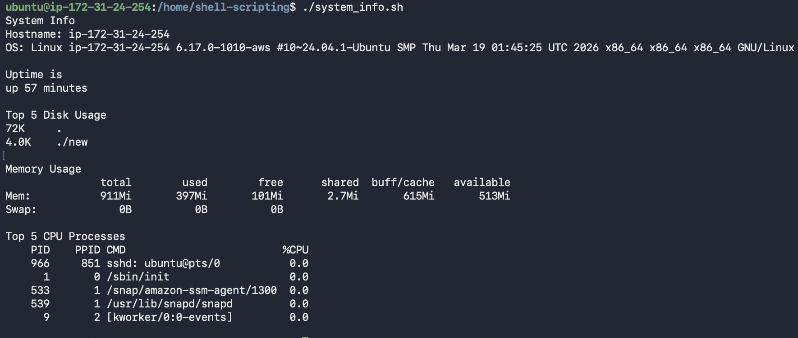

## Task 1: Basic Functions

```bash
#!/bin/bash

greet() {
        echo "Hello, $1!"
}

add() {
        sum=$(($1 + $2 ))
        echo "sum is $sum"
}

greet "Rutuja"
add 2 3

```


## Task 2: Functions with Return Values

```bash

#!/bin/bash

check_disk() {
        echo "Disk Usage"
        df -h /
}

check_memory() {
        echo "Memory Usage"
        free -h
}

echo "Sysytem health is "

echo "---------------"

check_disk
echo " "
check_memory

```


## Task 3: Strict Mode — set -euo pipefail

```bash
#!/bin/bash

set -euo pipefail

echo "Start"

# Test set -u (undefined variable)
echo "$name"

# Test set -e (command failure)
cd /not/exist

# Test pipefail
echo "hello" | grep "xyz" || echo "No match found"

echo "End"
```

## I have noticed that 
- set -e → Script exits immediately if any command fails



- set -u → Script exits if an undefined variable is used



- set -o pipefail → Script fails if any command in a pipeline fails



## Task 4: Local Variables

```bash
#!/bin/bash

local_func() {
    local var="local variable"
    echo "Inside local_func: $var"
}

global_func() {
    var="global variable"
    echo "Inside global_func: $var"
}

local_func
echo "Outside local_func: $var"

global_func
echo "Outside global_func: $var"
```


## Task 5: Build a Script — System Info Reporter

```bash
#!/bin/bash

set -euo pipefail

system_info() {
    echo "System Info"
    echo "Hostname: $(hostname)"
    echo "OS: $(uname -a)"
    echo ""
}

uptime_info() {
    echo "Uptime is"
    uptime -p
    echo ""
}

disk_usage() {
    echo  "Top 5 Disk Usage"
    du -h 2>/dev/null | sort -hr | head -n 5
    echo ""
}

memory_usage() {
    echo "Memory Usage"
    free -h
    echo ""
}

cpu_usage() {
    echo "Top 5 CPU Processes"
    ps -eo pid,ppid,cmd,%cpu --sort=-%cpu | head -n 6
    echo ""
}

main() {
    system_info
    uptime_info
    disk_usage
    memory_usage
    cpu_usage
}

main

```

