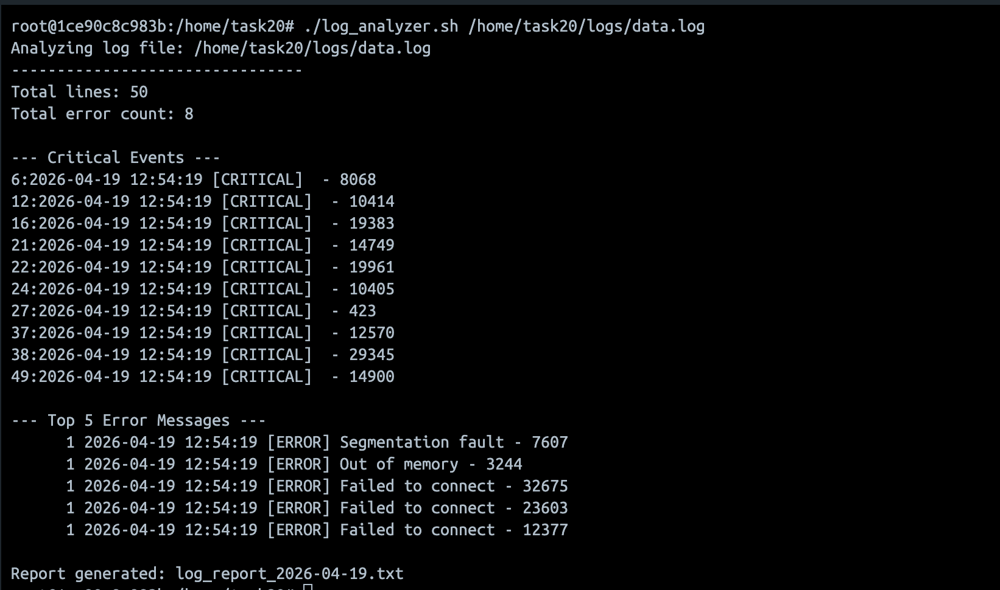

## Combine program for all tasks

```bash
#!/bin/bash

set -euo pipefail

# Validate input
if [ $# -eq 0 ]; then
    echo "Error: Please provide a log file path"
    exit 1
fi

log_file="$1"

if [ ! -f "$log_file" ]; then
    echo "Error: File does not exist: $log_file"
    exit 1
fi

# Functions
get_error_count() {
    grep -Eic "ERROR|Failed" "$log_file"
}

get_top_errors() {
    grep -i "ERROR" "$log_file" | sort | uniq -c | sort -nr | head -n 5
}

get_critical_events() {
    grep -n "CRITICAL" "$log_file" || echo "No critical events found"
}

# Collect data
total_lines=$(wc -l < "$log_file")
error_count=$(get_error_count)

# Console Output
echo "Analyzing log file: $log_file"
echo "--------------------------------"
echo "Total lines: $total_lines"
echo "Total error count: $error_count"
echo ""

echo "--- Critical Events ---"
get_critical_events
echo ""

echo "--- Top 5 Error Messages ---"
get_top_errors
echo ""

# Report file
report_file="log_report_$(date +%F).txt"

{
echo "Log Analysis Report"
echo "======================"
echo "Date of analysis: $(date)"
echo "Log file: $log_file"
echo "Total lines processed: $total_lines"
echo "Total error count: $error_count"
echo ""

echo "--- Top 5 Error Messages ---"
get_top_errors
echo ""

echo "--- Critical Events ---"
get_critical_events

} > "$report_file"

echo "Report generated: $report_file"

```
